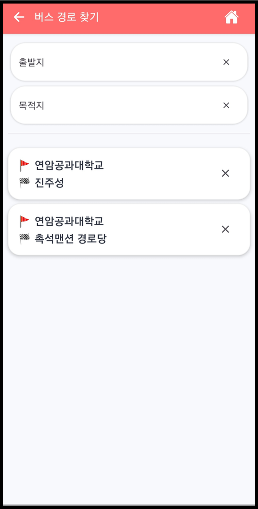
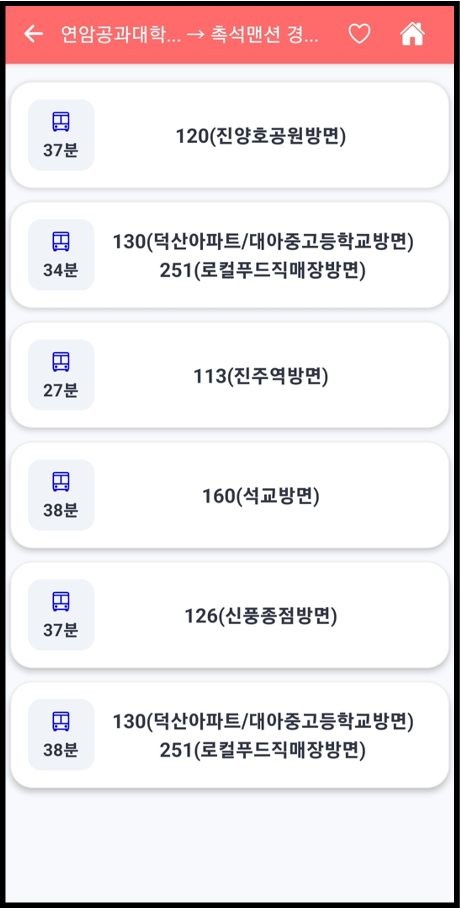
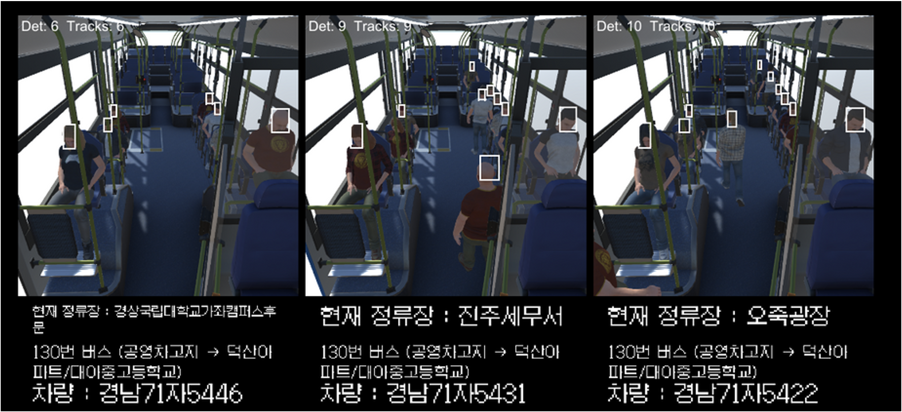
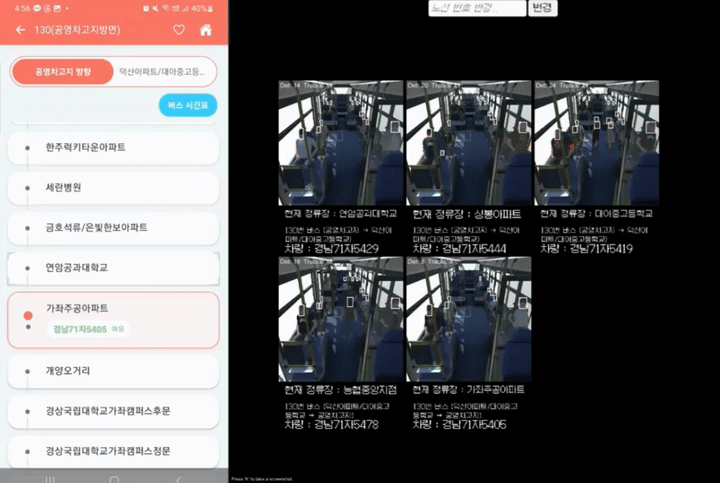

# 🚌 BustleBus Mobile

> **React Native 기반 실시간 버스 혼잡도 모니터링 앱**

---

## 📱 App Features

### 🏠 메인 화면

<div align="center">
  
</div>

- 직관적인 UI로 버스 검색 및 경로 탐색
- 실시간 버스 도착 정보 확인

---

### 🔍 버스 번호 검색

<div align="center">
  
</div>

- 버스 번호 기반 실시간 노선 정보 조회
- 즐겨찾기 기능으로 자주 이용하는 버스 빠른 접근

---

### 🗺️ 경로 검색

<div align="center">
  
  
</div>

- 출발지/도착지 기반 최적 경로 탐색
- 환승 정보 및 소요 시간 제공

---

### 📊 검색 결과 & 노선 상세

<div align="center">
  
  
</div>

- 상세한 정류장 정보 및 예상 도착 시간
- 혼잡도 정보를 통한 승차 가능 여부 판단

---

### 🎮 실시간 혼잡도 시뮬레이션

<div align="center">
  
</div>

- **Unity 시뮬레이션 연동**: 버스 내부 좌석 배치 및 승객 위치 시각화
- **YOLO 기반 혼잡도 분석**: 실시간 승객 수 및 혼잡도 모니터링
- WebView를 통한 React 대시보드 통합

---

## 🎥 데모 영상

<div align="center">
  
</div>

Unity 시뮬레이션과 앱이 실시간으로 연동되는 모습을 확인할 수 있습니다.

---

## 🛠️ Tech Stack

| Category             | Stack                                               |
| :------------------- | :-------------------------------------------------- |
| **Framework**        | React Native 0.81 + Expo 54                         |
| **Language**         | TypeScript 5.9                                      |
| **Navigation**       | Expo Router (File-based)                            |
| **State Management** | Jotai 2.12                                          |
| **Storage**          | AsyncStorage                                        |
| **UI Library**       | React Native Paper, Expo Linear Gradient, Expo Blur |
| **Animation**        | React Native Reanimated, Gesture Handler            |
| **API**              | Axios                                               |

---

## 🏗️ Architecture Highlights

### 📁 File-based Routing

```
app/
├── index.tsx              # 홈 화면
├── main/                  # 메인 페이지
├── searchBus/             # 버스 검색
├── searchRoute/           # 경로 검색
├── searchResultRoute/     # 경로 결과
├── busDetailPage/         # 버스 상세
└── busTimeTable/          # 시간표
```

### 🔄 WebView Communication

- React Native ↔ React Web 양방향 통신
- `view_key` 헤더 기반 보안 인증
- 실시간 혼잡도 데이터 동기화

### ⚡ Performance Optimization

- Jotai를 활용한 최소 리렌더링
- FlatList 최적화
- AsyncStorage 캐싱으로 오프라인 대응

---

## 🚀 Getting Started

### 설치

```bash
npm install
```

### 개발 실행

```bash
npx expo start
```

### 플랫폼별 실행

```bash
# Android
npm run android

# iOS
npm run ios
```

---

## 📂 Project Structure

```
├── app/              # Expo Router 페이지
├── components/       # 재사용 컴포넌트 (13개+)
├── atoms/            # Jotai 상태 관리
├── hooks/            # Custom Hooks
├── styles/           # 스타일 정의
├── types/            # TypeScript 타입
├── util/             # 유틸리티 함수
└── readme/           # 스크린샷 & 데모 영상
```

---

## 🎯 Key Features

✅ **실시간 버스 정보** - API 기반 도착 예정 시간 제공  
✅ **혼잡도 모니터링** - YOLO + Unity 시뮬레이션 연동  
✅ **즐겨찾기 관리** - 자주 이용하는 노선 저장  
✅ **경로 최적화** - 최적 경로 및 환승 정보  
✅ **오프라인 지원** - AsyncStorage 캐싱
